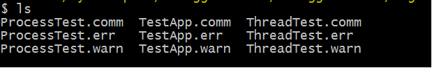
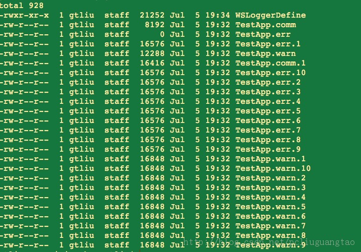

GTCLogModule
============

This log module can be used by C/C++/Objective-C projects. 

## Features
* high robustness and proformace
* process/thread safe;
* high configurable, include buffer size, log file numbers, log file size etc;
* three default log level and easily to expand;
* print buffer to reduce disk I/O times;
* easily change stdout/stderr between log file just according to a #define macro;
* detial document comments





## Usage 
It's very simple, you can learn from the test.c file.
```
    MITLogOpen("TestApp", "./logs");
    
    char dir[1024];
    getcwd(dir, sizeof(dir));
    MITLog_DetPrintf(MITLOG_LEVEL_COMMON, "%s", dir);
    
    // 1. usage in one thread demo
    // at first in main thread call MITLogOpen()
    MITLog_DetPuts(MITLOG_LEVEL_COMMON, "just have a try and feel the speed:write 3000000 messages");
    time_t starttime = time(NULL);
    for (int i=MITLOG_INDEX_COMM_FILE; i<=MITLOG_INDEX_ERROR_FILE; ++i) {
        for (int j=0; j < 1000000; ++j) {
            MITLogWrite(MITLOG_LEVEL_COMMON, "This is for common:%d", j);
            MITLogWrite(MITLOG_LEVEL_WARNING, "This is for warning:%d", j);
            MITLogWrite(MITLOG_LEVEL_ERROR, "This is for error:%d", j);
        }
    }
    time_t closetime = time(NULL);
    MITLog_DetPrintf(MITLOG_LEVEL_COMMON, "All time:%ld\n", closetime-starttime);
    // at last you should close the log module
    MITLogClose();
```

[Winlin](http://blog.csdn.net/pcliuguangtao)
